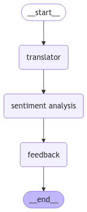

# User Guide: Customer Emotion Analysis System

## Introduction

The Customer Emotion Analysis System is a powerful tool designed to analyze customer feedback, extract emotions, identify topics, and provide personalized responses. This guide will help you set up and use the system effectively.

## Setup Instructions

### Prerequisites
Before installing the system, ensure you have:
- Python 3.8 or higher installed
- An active Groq API key

## Project Structure

```
customer-emotion-analysis-system/
├── .env                    # Environment variables (create this file)
├── requirements.txt        # Dependencies
├── services.py             # Services for translation and sentiment analysis
├── streamlit.py            # Web application interface
└── utils.py                # Data models and prompt templates
```

### Installation Steps

1. **Set up your environment**:
   ```bash
   # Create a new directory for the project
   mkdir customer-emotion-analysis
   cd customer-emotion-analysis
   
   # Create a virtual environment
   python -m venv venv
   
   # Activate the virtual environment
   # On Windows
   venv\Scripts\activate
   # On macOS/Linux
   source venv/bin/activate
   ```

2. **Create the required files**:
   Create the following files with the code provided in the project:
   - `requirements.txt`
   - `services.py`
   - `streamlit.py`
   - `utils.py`

3. **Install dependencies**:
   ```bash
   pip install -r requirements.txt
   ```

4. **Configure your API key**:
   Create a `.env` file in the project directory and add your Groq API key:
   ```
   GROQ_API_KEY=your-groq-api-key-here
   ```

5. **Launch the application**:
   ```bash
   streamlit run streamlit.py
   ```

6. Your browser should automatically open to `http://localhost:8501` displaying the application. If not, open this URL manually.

### Workflow
<p align="center">
  
</p>

## Troubleshooting
1. **API Key Errors**:
   - Ensure your Groq API key is correctly set in the `.env` file
   - Verify the API key is active and has sufficient quota

2. **Installation Problems**:
   - Make sure you're using Python 3.8 or higher
   - Try reinstalling the requirements: `pip install -r requirements.txt --force-reinstall`

3. **Processing Errors**:
   - If you encounter a "The input is not valid" error, try simplifying your feedback
   - Ensure your feedback contains meaningful content

4. **Display Issues**:
   - If charts don't display correctly, try refreshing the page

